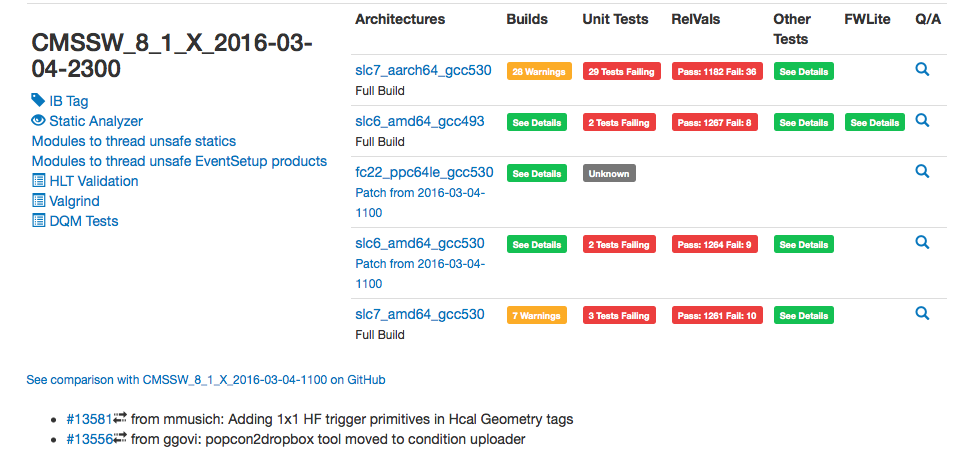

## Workflow for pull requests to CMSSW

This page is a short summary of the process we use for accepting code changes from CMS developers into CMSSW. It assumes knowledge of the CMSSW software and computing environment. 

Questions or problems? You can
   - Open a [gitHub issue](https://github.com/cms-sw/cmssw/issues)
   - Ask a question in the [CMS software development hypernews forum](https://hypernews.cern.ch/HyperNews/CMS/get/swDevelopment.html) 

### Before making your pull request
Confirm that you have checked out all dependencies, have a clean build, and all unit tests succeed

```
cd src
scram b distclean 
git cms-checkdeps -a -A
scram b -j 8
scram b runtests
```

Run a basic battery of tests

```
runTheMatrix.py -l limited -i all --ibeos
```

If these tests are successful, your code changes should also pass the basic checks done during the pull request testing procedure. Some tests, in particular the runTheMatrix.py tests require data available at sites such as CERN, ```--ibeos``` argument allows to read the files via CMSSW integration file catalog.

### Initial pull request 
   - [This tutorial](tutorial.html) provides instructions for making a pull request to CMSSW
   - New developments should be always submitted to the development release of CMSSW. The default branch in the CMSSW repository is always the master branch. **All feature/bug fix requests first need to be integrated into the master branch, so the default branch is the correct one when you first make your pull request.**
   - Pull requests including new packages require an extra check in order to review the code organization in CMSSW [Too be filled in]

### Code quality checks
Before code review begins, any pull request to CMSSW is reviewed against code quality checks. These checks current consist of the application of several clang-tidy checks to the files that the pull request touches. Issues identified by these checks must be fixed. 

There are two ways to apply any changes requested by the code quality checks. First, a patch is generated by the code quality check process. This patch can be downloaded and applied to your working area

```
curl https://cmssdt.cern.ch/SDT/code-checks/PR-20633/925/git-diff.patch | patch -p1
```

where the URL appropriate for your pull request will be provided by the code quality check in github. Alternatively, you can use this command to apply these checks against your code changes

```
scram build code-checks
```

In either case, simply apply these changes, commit and update your github branch. This will update your pull request and the code quality checks will be rerun automatically.

### Code review
   - Once your pull request is submitted, it is assigned a set of categories (e.g., "reconstruction") based on which packages have been changed. The mapping of code package to group is [here](https://github.com/cms-sw/cms-bot/blob/master/categories.py). Here is an example showing a new pull request with labels added and its milestone release (e.g., "CMSSW_8_0_X")

   - The [category managers](https://github.com/cms-sw/cms-bot/blob/master/categories.py) for those categories get an automatic email asking them to review the proposed changes. Until their review is complete, your pull request has a label that indicates it is waiting for their signature (e.g., "reconstruction-pending")
   - In addition, your PR will get labels for "tests-pending", "comparisons-pending" and "orp-pending". These are explained in the following steps.
   - Category managers can trigger a set of standard pull request tests by responding to the pull request issue in github with "please test"

   - After a few hours, the results of these tests are available ("tests-approved" label), including some low statistics physics comparisons ("comparisons-available" label). You might find it useful to check these results in case of problems. Sometimes these tests are affected by problems in the underlying integration build or computing infrastructure. If the errors do not appear to be from your pull request, do not worry. 

   - Code review can come via comments on the proposed changes or other discussion (typically in your github issue). Once each category manager is satisfied, they will sign your pull request ("+1"), and the corresponding label changes from "pending" to "approved" (e.g., "reconstruction-approved")

   - In case of no answers or slow answers from groups, it is useful to follow up either in your github issue, via mail or via the groups regular meeting
   - The last approval is from the release management team ("orp-approved"), after which your pull request will enter the CMSSW repository.


### Check the Integration Build
   - Twice per day, we run a more complete set of tests. The main web page for these results is [here](https://cmssdt.cern.ch/SDT/html/showIB.html). You can check this page a day after your pull request is accepted to check for issues with your pull request. 

   - As with the IB tests, there can be existing problems in the integration builds that will not be related to your pull request or other recently accepted pull requests. You can look at how the test results have changed from day to day to help decide if there are problems created by your pull request.

### Backporting
   - After your pull request has been accepted into the development release, it may be considered for use in older releases if there is a production or analysis use case for it. If this is the case, you can start the process by making a new pull request in the release cycle where your changes are required. Be sure to check if you have rebased your changes properly before submitting the pull request. The easiest way is to check the differences that GitHub shows before you submit the pull request; for more details, see the tutorial [Resolving conflicts & porting features](tutorial-resolve-conflicts.html)).
   - For simple pull requests, a successful set of tests in the integration build system may be sufficient. However, most often your pull request should be tested in a full release and through the release validation system ("relvals").
   - Backporting requests are discussed weekly in the release operations meeting (Tuesdays at 1700 CERN time). To have your request added to the agenda, simply bring it to the attention of the appropriate category managers.

