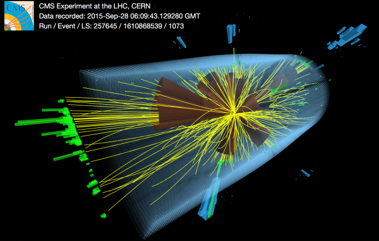

# Welcome to CMS and CMSSW

<tr>
    <td>  </td>
</tr> 

The LHC smashes groups of protons together at close to the speed of light: 40
million times per second and with seven times the energy of the most powerful
accelerators built up to now. Many of these will just be glancing blows but
some will be head on collisions and very energetic. When this happens some of
the energy of the collision is turned into mass and previously unobserved,
short-lived particles – which could give clues about how Nature behaves at a
fundamental level - fly out and into the detector. Our work includes the experimental
discovery of the [Higgs boson](http://home.cern/topics/higgs-boson), which lead to the
award of a Nobel prize for the underlying theory that predicted the Higgs boson
as an important piece of the standard model theory of particle physics.

CMS is a particle detector that is designed to see a wide range of particles
and phenomena produced in high-energy collisions in the LHC. Like a cylindrical
onion, different layers of detectors measure the different particles, and use
this key data to build up a picture of events at the heart of the collision.

Many of CMS Software components (CMSSW) are [hosted on
Github](https://github.com/cms-sw). You can find here a [few FAQ](faq.html)
and tutorials on how develop in CMSSW.
