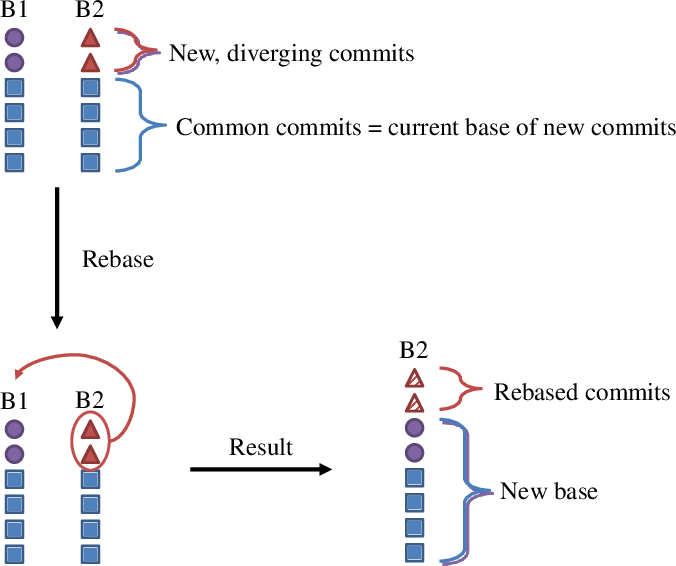

## Tutorial: resolve conflicts & port features

One of the greatest advantages of _git_ is that it is much smarter at handling
conflicts between different contribution to the same repository. In particular
it automatically handles the case of two parallel developments, both changing
the same package in orthogonal ways. As smart as it can be, however,
git does not know about the mass of the Higgs or how to resolve conflicts where two
people modified the same line in different ways. This latter case is however
automatically detected by GitHub, which will point out that your changes cannot
be merged automatically.

This tutorial will show you how to resolve the latter problem using the `git rebase` command
and several CMS-specific wrapper commands.

### Uses of CMS commands

* `git cms-rebase-topic`:
    * moving a branch to a new IB/release
    * rebasing a branch to resolve merge conflicts
* `git cms-checkout-topic`:
    * recreating a working area  
      (in case it got deleted or corrupted, but the base CMSSW release still exists)
    * working on top of another topic branch  
      (see tutorial [Collaborating with peers](tutorial-collaborating-with-peers.html))
    * preparing to build a CMSSW patch release
    * setting up for advanced use of `git rebase`
* `git cms-merge-topic`:
    * *testing* a branch or PR
    * combining multiple patches in a private recipe/release
    * ***NOT*** to be used when developing PRs!

### Overview of rebasing

Rebasing means changing the base for a group of commits.
The most general way to use the `git rebase` command requires three pieces of information:
the new base, the old base, and the branch to be rebased. The old base is the latest commit
*before* the new changes in the branch. Both of the bases can be specified as branch names,
tags, or commit hashes (branch names and tags correspond to labels for commit hashes in git).

The `git rebase` command takes the new changes from the branch, which were previously made on 
top of the old base, and applies each commit, one by one, in order, to the new base. The
rebased commits will have different hashes than the old versions of the commits, because the
history (and potentially the content) has changed. To visualize this process, consult the 
following diagram:



If there is a conflict when applying a certain commit during the rebase,
git will pause so you can edit the conflicting files to resolve the conflict.
You can then continue the rebase. (An example of this process will be shown in the tutorial.)

The advantage of rebasing to resolve conflicts is that it preserves a linear history.
Your development in your topic branch is restructured *as though* you had made your changes
*after* other developers made their conflicting changes. This reflects the order in which
features get merged into the official repository, and puts the onus on developers to keep
their topic branches up to date.

One potential downside of rebasing is that it can cause difficulties for others who may have built
topic branches on top of your branch (due to rewriting the branch history).
If you are working collaboratively with any other developers (e.g. testing features privately
before submitting a PR), it is polite to let them know when you are going to rebase, and keep a backup
branch with the old history in case they need it.

If something goes wrong during the rebase, you can restore the previous state of your branch
using `git reflog` (see the [FAQ](faq.html#i-made-a-mess-and-i-do-not-know-what-ive-currently-checked-out)
for more info).

### Prerequisites

Please make sure you are registered with GitHub and that you have provided them
a ssh public key to access your private repository. For more information see
the [FAQ](faq.html#how-do-i-subscribe-to-github). It is also a good idea to make sure
your `CMSSW_GIT_REFERENCE` variable is set appropriately 
(again, see the [FAQ](faq.html#downloading-from-github-is-painfully-slow-how-can-i-improve-the-situation)).

We will also assume that there is a non mergeable branch called
`Unmergeable8025` in the repository of the user `kpedro88`.

### Create a CMSSW area

First, let's create an area for the latest / greatest CMSSW available. This will be your *new base*.
```
scram project CMSSW_8_0_26
cd CMSSW_8_0_26/src
cmsenv
```

### Rebase the unmergeable branch

Rebasing is an entirely git-based operation. Generally, it is not advisable to try to
compile or run code in the middle of a rebase.

Very important note: ***NEVER*** use `git cms-merge-topic` to resolve conflicts in a pull request!!!
This can introduce hundreds of duplicate commits. Release and package managers have the right
and the responsibility to reject such broken pull requests immediately.

Let's use the simple `cms-rebase-topic` command to deal with the unmergeable branch in your working area.
```
git cms-rebase-topic kpedro88:Unmergeable8025
```

This will fail with a message like:
```
First, rewinding head to replay your work on top of it...
Applying: add new PU scenario
Using index info to reconstruct a base tree...
M       Configuration/StandardSequences/python/Mixing.py
Falling back to patching base and 3-way merge...
Auto-merging Configuration/StandardSequences/python/Mixing.py
CONFLICT (content): Merge conflict in Configuration/StandardSequences/python/Mixing.py
Failed to merge in the changes.
Patch failed at 0001 add new PU scenario
The copy of the patch that failed is found in:
   /uscms_data/d3/pedrok/phase2/rebase/test3/CMSSW_8_0_26/src/.git/rebase-apply/patch

When you have resolved this problem, run "git rebase --continue".
If you prefer to skip this patch, run "git rebase --skip" instead.
To check out the original branch and stop rebasing, run "git rebase --abort".
```
which means that the file `Configuration/StandardSequences/python/Mixing.py`
has changed in conflicting ways in the branch `kpedro88:Unmergeable8025` and the
the release `CMSSW_8_0_26`.

### Resolving conflicts during the rebase

The conflicting changes can be viewed by using the `git diff` command:
```
git diff
diff --cc Configuration/StandardSequences/python/Mixing.py
index 6c3a015,280f8e9..0000000
--- a/Configuration/StandardSequences/python/Mixing.py
+++ b/Configuration/StandardSequences/python/Mixing.py
@@@ -111,7 -111,7 +111,11 @@@ addMixingScenario("2015_25ns_FallMC_mat
  addMixingScenario("2016_25ns_SpringMC_PUScenarioV1_PoissonOOTPU",{'file': 'SimGeneral.MixingModule.mix_2016_25ns_SpringMC_PUScenarioV1_PoissonOOTPU_cfi'})
  addMixingScenario("2016_25ns_Moriond17MC_PoissonOOTPU",{'file': 'SimGeneral.MixingModule.mix_2016_25ns_Moriond17MC_PoissonOOTPU_cfi'})
  addMixingScenario("mix_2016_PoissonOOTPU_HighPUTrains_Fill5412",{'file': 'SimGeneral.MixingModule.mix_2016_PoissonOOTPU_HighPUTrains_Fill5412_cfi'})
++<<<<<<< HEAD
 +addMixingScenario("mix_2016_PoissonOOTPU_HighPUIsolated_Fill5412",{'file': 'SimGeneral.MixingModule.mix_2016_PoissonOOTPU_HighPUIsolated_Fill5412_cfi'})
++=======
+ addMixingScenario("AVE_200_BX_25ns_minOOT",{'file': 'SimGeneral.MixingModule.mix_POISSON_average_cfi','BX':25, 'B': (-3,1), 'N': 200})
++>>>>>>> add new PU scenario
  addMixingScenario("ProdStep2",{'file': 'SimGeneral.MixingModule.mixProdStep2_cfi'})
  addMixingScenario("fromDB",{'file': 'SimGeneral.MixingModule.mix_fromDB_cfi'})
```

As expected, the file that has problems is `Configuration/StandardSequences/python/Mixing.py`.
Conflicts are marked using 
[merge conflict markers](https://help.github.com/articles/resolving-a-merge-conflict-using-the-command-line/),
(the same way they were on CVS): the `<<<<<<<` and `>>>>>>>` delimiters, and the
`=======` separator. The version on top (marked with `HEAD`) is the one which is
available in our work area. The version on the bottom (marked with
the commit message, "add new PU scenario") is the one which belong to the topic branch we are
trying to merge. In this particular case, we want to keep both new lines. 
Therefore, we make the changes via our preferred editor (`nano` used here for simplicity).
```
nano Configuration/StandardSequences/python/Mixing.py
<fix the conflict, remove the conflict markers>
```

Once we have done it, we can do `git diff` again to see the changes:
```
/StandardSequences/python/Mixing.py
index 6c3a015,280f8e9..0000000
--- a/Configuration/StandardSequences/python/Mixing.py
+++ b/Configuration/StandardSequences/python/Mixing.py
@@@ -111,7 -111,7 +111,8 @@@ addMixingScenario("2015_25ns_FallMC_mat
  addMixingScenario("2016_25ns_SpringMC_PUScenarioV1_PoissonOOTPU",{'file': 'SimGeneral.MixingModule.mix_2016_25ns_SpringMC_PUScenarioV1_PoissonOOTPU_cfi'})
  addMixingScenario("2016_25ns_Moriond17MC_PoissonOOTPU",{'file': 'SimGeneral.MixingModule.mix_2016_25ns_Moriond17MC_PoissonOOTPU_cfi'})
  addMixingScenario("mix_2016_PoissonOOTPU_HighPUTrains_Fill5412",{'file': 'SimGeneral.MixingModule.mix_2016_PoissonOOTPU_HighPUTrains_Fill5412_cfi'})
 +addMixingScenario("mix_2016_PoissonOOTPU_HighPUIsolated_Fill5412",{'file': 'SimGeneral.MixingModule.mix_2016_PoissonOOTPU_HighPUIsolated_Fill5412_cfi'})
+ addMixingScenario("AVE_200_BX_25ns_minOOT",{'file': 'SimGeneral.MixingModule.mix_POISSON_average_cfi','BX':25, 'B': (-3,1), 'N': 200})
  addMixingScenario("ProdStep2",{'file': 'SimGeneral.MixingModule.mixProdStep2_cfi'})
  addMixingScenario("fromDB",{'file': 'SimGeneral.MixingModule.mix_fromDB_cfi'})
```

We can now add our changes and continue:
```
git add Configuration/StandardSequences/python/Mixing.py
git rebase --continue
```
This means the commit entitled "add new PU scenario" has been modified to avoid the conflict 
in the new base release CMSSW_8_0_26.

If you look at the current list of branches with `git branch`, you will see that a branch named "..._backup" has been added by default:
```
  CMSSW_8_0_X
* Unmergeable8025
  Unmergeable8025_backup
  from-CMSSW_8_0_26
  kpedro88/Unmergeable8025
  rebase-attempt
```
This backup branch contains the state of the branch before the rebase was done.

### Finalizing the updates

The temporary branch is now up-to-date with the current release. This means that it is safe to
checkout the dependencies and make sure the code compiles. (Depending on the extent of the conflicts,
you may want to rerun some of the [standard PR tests](PRWorkflow.html#before-making-your-pull-request) locally.)
```
git cms-checkdeps -a
scram b
```

Finally, you can push the rebased branch to your remote fork, which will automatically update your pull request.
(Note that the `-f` option is necessary, because rebasing rewrites the history of the branch.)
```
git push -f my-cmssw Unmergeable8025
```

Warning: sometimes, git gets confused while rebasing and checks out other packages (which you may not actually need to recompile).
The easiest way around this is to rearrange the last few commands: rather than doing `git cms-checkdeps -a` and `scram b`, skip to
`git push -f my-cmssw Unmergeable8025`. Then, create and setup a new working area:
```
scram project CMSSW_8_0_26
cd CMSSW_8_0_26/src
cmsenv
git cms-checkout-topic kpedro88:Unmergeable8025
scram b
```
Here, you do a "safe" checkout, which automatically checks out any dependent packages as well.

### Recovering from a bad rebase (or merge)

If something went wrong during your rebase, or if you accidentally used `cms-merge-topic` and your PR has been rejected,
you should go back to your working area and use the automatically-created backup branch:
```
git push -f my-cmssw [branch]_backup:[branch]
```
where `[branch]` is the name of your branch.

If you have made subsequent commits in the broken branch, you may want to keep the broken branch so you can `cherry-pick` the new commits later:
```
git push -f my-cmssw [branch]:[branch]_broken
```

Once you have recovered the previous state of your branch, please follow the approved procedures as outlined here.

### More advanced options

If you want access to options of `git rebase` that are not provided in `git cms-rebase-topic`,
you can use `git cms-checkout-topic -u` and then use the `git rebase` command.
(The `-u` option avoids calling `cms-checkdeps` before the branch is rebased.)

If you find that the rebased code does not compile or run correctly because of a mistake
during the rebase process, you can make an additional commit to fix the problem. 
However, advanced users may instead try the `git rebase --interactive` option,
which allows you to edit the existing commits. This means that you can solve any problems
in-place and preserve the linear development history.

### The above is all great stuff but I need a quick recipe!

This is the most concise recipe to rebase your branch, resolve conflicts, and update your PR.
You can also use this recipe to move to a new IB. (If there are no conflicts, the `cms-rebase-topic` command
will automatically call `cms-checkdeps -a` when it finishes.)

```
cmsrel [NEW_RELEASE]
cd [NEW_RELEASE]/src
cmsenv
git cms-rebase-topic [user]:[my-branch]

<resolve conflicts as needed>

git cms-checkdeps -a
scram b

git push -f my-cmssw [my-branch]
```

### Backporting a PR

Any pull request for a new feature must first be submitted to the open development branch (always the `master` branch).
Some features may need to be backported to older CMSSW versions, e.g. to fix bugs for data-taking or add options for MC production.

If we needed to backport the change from the above example branch `kpedro88:Unmergeable8025` to the `CMSSW_7_4` series,
the exact same rebasing procedure can be followed. The "new base" in this case is the latest release `CMSSW_7_4_16`
(instead of `CMSSW_8_0_26`, as we used in the example). That's right; rebasing can work in any "direction".

However, it is necessary to provide more information when porting a PR between branches, since different branches
may have different commits beyond the changes you have made in your topic branch.

In the case of a backport, you should make a copy of your original topic branch and rebase the copy, 
because you will submit a separate PR.

Example:
```
scram project CMSSW_7_4_16
cd CMSSW_7_4_16/src
cmsenv
git cms-rebase-topic --old-base CMSSW_8_0_25 kpedro88:Unmergeable8025
<resolve conflicts>
git branch -m Unmergeable8025_7416
```

Notice that you have to specify the "old base" of the branch with the `--old-base` (or simply `-o`) option. This does several things:
* Uses the "old base" to determine which packages you have changed, to avoid checking out unneeded packages
with `cms-addpkg`. (This works with any `cms-...-topic` command).
* Uses a more explicit form of of the `git rebase` command: `git rebase --onto [new base] [old base] [branch]`. (You can also specify
the new base with the `--new-base` or `-n` option; by default, it uses `$CMSSW_VERSION`.)

Remember, `[new base]` and `[old base]` can be commit hashes rather than tags.
If you are working in an integration build (IB) that has expired (so the tag is no longer available),
or if you lost your original working area and forgot which release was your old base,
you can use `git log` or the GitHub history view to find the hash of the latest commit before your changes, and proceed normally.

### Cherry-picking commits

There are a few cases where you might want to individually apply commits from one branch to another branch, rather than rebasing.
(Other cases may exist as well.)
1. You encountered a serious problem while rebasing, and your topic branch is in some difficult-to-recover state.
2. You have a backport PR open at the same time as the main PR, and you had to update the main PR 
(e.g. to fix a bug or respond to code review).
3. You want to make a backport PR with only a subset of features from some topic branch.

You can accomplish this using the `git cherry-pick [hash]` command.
`[hash]` is a commit hash; it can also be a list or range of commit hashes (which will be applied in order).

As with rebasing, if you encounter a conflict, the cherry-pick will pause so you can fix the conflict.
If you only cherry-picked one commit, you would then make a new commit once things are fixed.
If you cherry-picked multiple commits, you would then use `git cherry-pick --continue`.

If you're updating a backport, you may need to use `git fetch my-cmssw` in your backport working area to inform
the local git repository about new commits you have added in your remote.
You can also add a remote pointing to someone else's fork of CMSSW if you want to cherry-pick from their commits.
